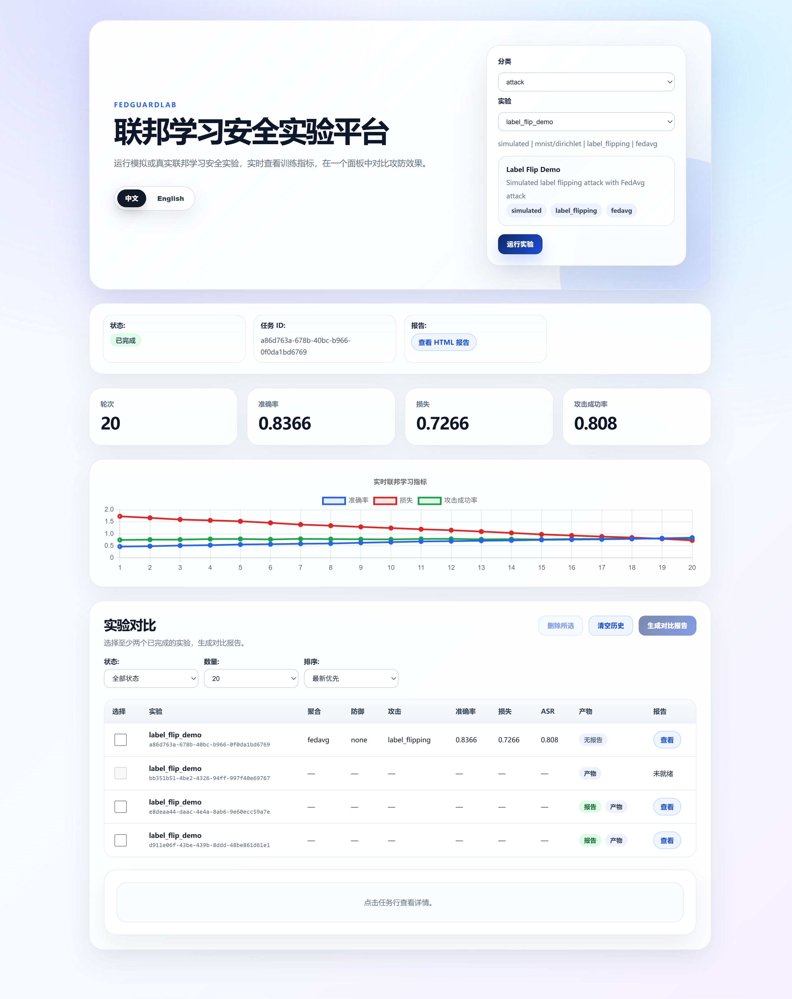
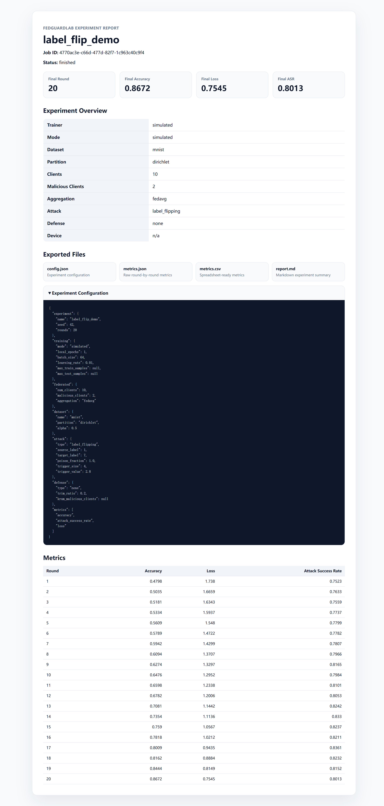
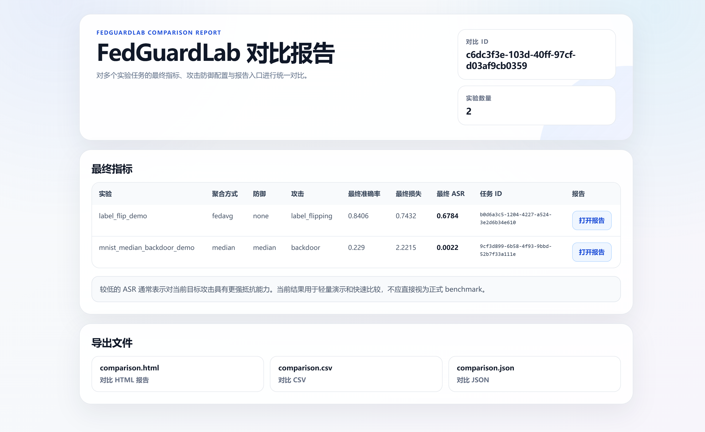

# FedGuardLab

> Current maintenance release: v1.9.1 maintenance release after v1.9.0, documenting GitHub Actions Node 24 compatibility workflow maintenance.


FedGuardLab 是一个面向联邦学习安全实验的轻量级交互式平台。

它的目标不是构建一个“大而全”的联邦学习 benchmark，而是提供一个易启动、可视化、可复现的实验环境，帮助学生、研究者和开发者直观理解联邦学习中的攻击、防御、训练过程和实验对比。

---

## 功能亮点

* 可视化联邦学习安全实验 Dashboard
* 默认中文界面，支持 English 切换
* FastAPI 后端 + Vue / Vite 前端
* YAML 实验配置与 Pydantic 校验
* 后台任务执行与实时指标查看
* 支持 Simulated trainer 快速演示
* 支持真实 MNIST + FedAvg 联邦学习训练
* 支持 IID / Dirichlet Non-IID 数据划分
* 支持 Label Flipping 攻击与 ASR 评估
* 支持 Backdoor 攻击与 Backdoor ASR 评估
* 支持 Median / Trimmed Mean / Krum 鲁棒聚合防御
* 支持单实验 HTML / CSV / Markdown 报告
* 支持多实验对比报告
* 支持 Docker Compose 一键启动
* 支持 GitHub Actions CI 与 Docker Smoke 验证

---

## 截图预览

### 实验 Dashboard



### 实验报告



### 对比报告



---

## 快速开始

### 1. 克隆项目

```bash
git clone https://github.com/Calvin1989/FedGuardLab.git
cd FedGuardLab
```

### 2. 创建 Python 环境

```bash
conda create -n fedguardlab python=3.11 -y
conda activate fedguardlab
```

### 3. 安装后端依赖

```bash
python -m pip install -r requirements-cpu.txt
```

`requirements-cpu.txt` 使用 CPU 版 PyTorch，适合本地开发、演示和 CI 环境。

### 4. 启动后端

```bash
uvicorn api.main:app --reload
```

后端默认地址：

```text
http://127.0.0.1:8000
```

API 文档：

```text
http://127.0.0.1:8000/docs
```

### 5. 启动前端

打开另一个终端：

```bash
cd web
npm install
npm run dev
```

前端默认地址：

```text
http://localhost:3000
```

如果 3000 端口被占用，Vite 会自动切换到其他可用端口。

---

## Docker 启动

确保已经安装 Docker Desktop。

```bash
docker compose up --build
```

访问地址：

```text
前端：http://localhost:3000
后端：http://localhost:8000/docs
```

停止服务：

```bash
docker compose down
```

---

## 常用验证命令

### 后端与基础测试

```bash
ruff check .
python quick_test.py
```

### 前端构建

```bash
cd web
npm run build
cd ..
```

### API Smoke Test

后端启动后运行：

```bash
python api_smoke_test.py
```

等待实验任务完整结束并生成 finished job id：

```bash
python api_smoke_test.py --wait-finished --write-finished-job-id smoke_finished_job_id.txt
```

### Docker Smoke 验证

```bash
docker compose config
docker compose build
docker compose up -d
python api_smoke_test.py --wait-finished --write-finished-job-id smoke_finished_job_id.txt
type smoke_finished_job_id.txt
$jobId = Get-Content smoke_finished_job_id.txt
docker compose restart backend
Start-Sleep -Seconds 10
python api_smoke_test.py --check-recovery $jobId
docker compose down
Remove-Item smoke_finished_job_id.txt
```

---

## 当前支持的实验能力

FedGuardLab 当前支持：

* Simulated Label Flipping Demo
* MNIST FedAvg Demo
* MNIST FedAvg + Label Flipping
* MNIST FedAvg + Backdoor Attack
* Label Flipping + Median Defense
* Label Flipping + Trimmed Mean Defense
* Label Flipping + Krum Defense
* Backdoor + Median Defense
* Backdoor + Trimmed Mean Defense
* Backdoor + Krum Defense
* 多实验指标对比与报告导出

更多说明见：

* [实验说明](docs/experiments.md)
* [配置文件说明](docs/configs.md)

---

## 实验输出

单实验输出目录：

```text
reports/jobs/<job_id>/
├── config.json
├── metrics.json
├── metrics.csv
├── report.html
└── report.md
```

多实验对比输出目录：

```text
reports/comparisons/<comparison_id>/
├── comparison.html
├── comparison.json
└── comparison.csv
```

这些运行产物默认不会提交到 GitHub。

---

## 项目文档

* [实验说明](docs/experiments.md)
* [配置文件说明](docs/configs.md)
* [开发与测试](docs/development.md)
* [Roadmap](docs/roadmap.md)

---

## 当前版本

当前稳定版本：

```text
v1.8.10
```

当前预览版本：

```text
v1.9.0-alpha.1
```

v1.9.0-alpha.1 重点改进：

* History experiment management UI：将 Dashboard 下半部分整理为"历史实验与对比"，明确区分历史实验、可对比实验、已选择实验和当前筛选状态。
* Experiment comparison readiness：增加列表实验数、可对比实验数、已选择实验数和筛选状态摘要。
* Job detail polish：减少重复状态信息，只在必要时显示报告未就绪状态。
* Event timeline polish：优化事件时间线文案、图标位置和中文展示。
* Round log layout polish：训练轮次详情改为更紧凑的一行展示。

---

v1.8.10 重点改进：

* Dashboard runtime summary UI polish：统一状态值与运行指标的视觉尺寸和层级。
* Deferred report card：未启动实验时隐藏报告卡片，实验启动后显示“未就绪”，报告生成后显示“HTML 报告 / HTML report”。
* Dashboard job detail density polish：压缩任务详情、导出文件、事件时间线、训练轮次详情和已选择实验区域的垂直空间。
* Config preview i18n polish：优化配置预览中文化、Attack / Defense 文案、空状态和下拉框宽度。
* Documentation sync：同步 README、CHANGELOG、roadmap 和 Dashboard / report 截图，使文档与 v1.8.9 当前稳定状态一致。
* Comparison completion polish：对比报告生成后不再显示"至少需要选择 2 个实验才能生成对比报告"的提示，并压缩对比完成态、结果洞察和事件时间线区域。
* Verification hardening：v1.8.10 已通过 ruff、quick test、pytest、frontend build、API smoke 和 Docker recovery 全流程验证。

兼容性说明：

* 不新增运行时依赖。
* 不改变已有 API 路径。
* 不改变训练核心算法。
* 不改变已有 report/artifact URL。
* 不改变 Docker runtime 行为。
* 不改变测试数据结构。
* 继续保持中文 / English 双语支持。

---

## 许可证

MIT

## v1.9.0-alpha.10 status

Current v1.9 alpha focus: Experiment Result Management.

Completed in the v1.9 alpha series:

- Dashboard history experiment management.
- Job archive / restore and archived job filtering.
- Comparison report history listing.
- Unified report and artifact entry styling.
- Local reports cleanup summary.
- Reports cleanup run API with dry-run default and explicit confirmation for deletion.
- Dashboard cleanup run controls with preview, confirmation, and result feedback.

Reports cleanup safety model:

- Summary endpoint is read-only.
- Cleanup run defaults to dry-run.
- Real deletion requires `dry_run=false` and `confirm=true`.
- Cleanup candidates come from the backend preview.
- Existing report artifact URLs remain unchanged.

> Current v1.9 status: `v1.9.0-beta.1` is the beta readiness milestone for Experiment Result Management. It validates the completed v1.9 alpha scope, including job archive / restore, comparison history, report entry unification, and reports cleanup summary / run safety controls.
> Current v1.9 status: `v1.9.0-rc.1` is the release candidate readiness milestone for Experiment Result Management. It adds no runtime feature and focuses on final validation of history management, archive / restore, comparison history, report entry unification, and safe reports cleanup.
> Current stable release: `v1.9.0` finalizes Experiment Result Management with history management, archive / restore, comparison history, unified report entries, and safe reports cleanup.
